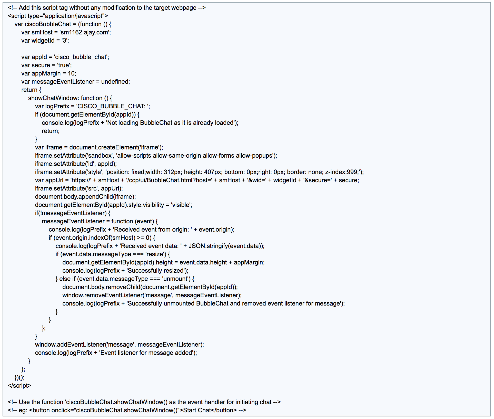
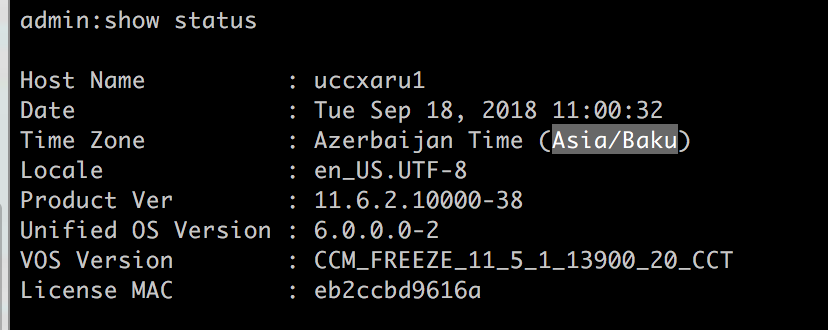

# Cisco SocialMiner - BubbleChat Scheduling Sample

_Sample web application (Javascript) which encapsulates Bubble Chat invocation (via a customer website) to implement a basic scheduling based on working hours and holidays._

## Overview

[Bubble chat](https://www.cisco.com/c/en/us/td/docs/voice_ip_comm/cust_contact/contact_center/crs/express_11_6_2/features/guide/uccx_b_features-guide-1162/uccx_b_features-guide-1162_appendix_0101.html#reference_7AD861E6CB38C3846FE8D8BF59D702A2) is an out-of-box, next-generation embedded end-user chat experience offered by Cisco Unified CCX (via Cisco SocialMiner), starting release 11.6(2). However, in SocialMiner 11.6.2, to apply schedules (working and non-working hours) for Bubble Chat, custom wrappers can be created. This code sample intends to illustrate and help in achieving seamless experience of adding scheduling with [Bubble chat](https://www.cisco.com/c/en/us/td/docs/voice_ip_comm/cust_contact/contact_center/crs/express_11_6_2/features/guide/uccx_b_features-guide-1162/uccx_b_features-guide-1162_appendix_0101.html#reference_7AD861E6CB38C3846FE8D8BF59D702A2).

## Pre-requisites

- Unified CCX 11.6(2) and above, configured with email and chat using SocialMiner 11.6(2) and above

- Customer website via which end users would be initiating their chat requests


## Configuring Bubble Chat on UCCX administration

Before proceeding further, users need to create a Bubble Chat widget as described in [end user guides](https://www.cisco.com/c/en/us/support/contact-center/socialminer-11-6-2/model.html#End-UserGuides). Source code generated for chat widget would look like following. Please note the following image is only for illustration purpose.

    

## Code modification in customer website

### Sourcing dependencies
The modifications recommended by this manual are in addition to those instructions that come with conventional bubble chat deployment.
The core intelligence of chat scheduler lies in `scripts/schedule.js` which is equipped to get receive config information in JSON format.
Ensure that this file is included/sourced as shown below.

```html
<script src='__PATH__/schedule.js'> </script>
```

For example:
```html
<script src='./scripts/schedule.js'> </script>
```

### Reading schedule configuration
Users are expected to send the URL of schedule config as part initializing the script and it is recommended to initialize the same at the time of loading of HTML body tag as shown below.

```html
<body onload="readConfig(URL)">
//main code
</body>
```

For example:
```html
<body onload="readConfig('http://localhost:3000/scripts/schedule_config.json')">
//main code
</body>
```

### Checking for OPERATING HOURS

Once, the sourcing and loading the config information is completed, working hours compliance is determined by invoking  `_isOperatingHour()`. It can be used to display (or not) the Bubble Chat window as shown below.

```javascript
<button onclick="checkScheduleAndShowChatBubble()">Initiate chat with our support executive</button>

<script>
function checkScheduleAndShowChatBubble() {
    if (isOperatingHour()) {
      // load bubble chat form for the end user
        ciscoBubbleChat.showChatWindow();
    } else {
      /* The following line shows an alert message to end user
       * if the chat initiation request was not in operating hours.
       * The alert command is only for illustration purpose,
       * the choice of action/message for chat requests in non-working hours is left to programmer's prerogative.
       */
        alert('working hours closed');
    }
}
</script>
```

## Understanding and configuring schedule information in JSON

`schedule_config.json` (name of the config file is not hard set, users can change it and source it appropriately) is basically divided in 3 sections namely _holidays_, _specialDays_, _routineDays_. Please refer the [sample config file](scripts/schedule_config.json) for reference. The keys in the JSON file is case sensitive and be advised not to change it.

### _timezone_

Here website administrator needs to provide the UCCX server timezone which can be obtained from CLI command as shown in below image.



```javascript
"timezone": "Asia/Baku"
```

### _holidays_

As name suggests, this section can be used to configure holidays. Users need to specify date of supposed holidays, separated by **','** in YYYY-MM-dd format. Upon setting a particular day as holiday, whole day would be considered as NON-OPERATING hours for chat feature.

```javascript
"holidays": [
  "2018-09-13"
]
```

### _specialDays_

Users can use this section to configure particular dates with irregular or unusual operating hours. This section expects both date and corresponding operating hours where the latter is provided in form of minutes.
For example, for Bubblechat operations to be running only between **10AM** to **3PM** on 3rd Nov 2018, it can be configured as following.

```javascript
"specialDays": [
  {
    "date": "2018-11-03",     // date with irregular operating hours
    "workTime": {
      "startTime": 600,       // 10AM => 10th hour in 24 hours format => 10 * 60 minutes => 600 minutes
      "endTime": 900          //  3PM => 15th hour in 24 hours format => 15 * 60 minutes => 900 minutes
    }
  }]
```

There is also a facility to mark multiple dates as special days with individual operating hours as shown below.

```javascript
"specialDays": [
  {
    "date": "2018-11-05",     // date with irregular operating hours, Nov 5th 2018
    "workTime": {
      "startTime": 570,       //  9:30AM => 10th hour in 24 hours format => (9 * 60) + 30 minutes => 570 minutes
      "endTime": 910          //  3:10PM => 15th hour in 24 hours format => (15 * 60) + 10 minutes => 910 minutes
    }
  },
  {
    "date": "2018-11-06",     // date with irregular operating hours, Nov 6th 2018
    "workTime": {
      "startTime": 0,         // 12AM => 0th hour in 24 hours format => 0 * 60 minutes => 0 minute
      "endTime": 180          //  3AM => 3rd hour in 24 hours format => 3 * 60 minutes => 180 minutes
    }
  }
 ]
```

### routineDays

Very much similar to specialDays, routineDays' configuration is also pretty straight forward. Here, instead of exact date, days of week are configured with individual operating hours as shown below.


```javascript
"routineDays": [
  {
    "day": "1",   // 1 is code for monday
    "workTime": {
      "startTime": 300,
      "endTime": 1140
    }
  },
  {
    "day": "2",  // 2 is code for tuesday
    "workTime": {
      "startTime": 360,
      "endTime": 1200
    }
  },
  {
    "day": "3", // 3 is code for wednesday
    "workTime": {
      "startTime": 1130,
      "endTime": 1140
    }
  },
  {
    "day": "4", // 4 is code for thursday
    "workTime": {
      "startTime": 360,
      "endTime": 1200
    }
  },
  {
    "day": "5", // 5 is code for friday
    "workTime": {
      "startTime": 1000,
      "endTime": 1080
    }
  }
]

```

Absence of configuration for any day of the week(saturday and sunday in case of above example) would by default be considered as **NON-OPERATING** days.

## Disclaimer
This sample should act as a guide for a programmer to understand how to configure custom scheduling with Bubble Chat. Please refer [SocialMiner Developer's Guide](https://developer.cisco.com/site/socialminer/documentation/) for further details about Bubblechat. Please see the _"Web Chat"_ section of [Unified CCX Configuration Guides](https://developer.cisco.com/site/contact-center-express/docs/) for instructions on deploying Unified CCX Web Chat Feature.

This is only a sample and is NOT intended to be a production quality application and will not be supported as such. It is NOT guaranteed to be bug free. It is merely provided as a guide for 3rd-party developers on best practices and usage of the SocialMiner RESTful APIs and is not intended for production use "as is".

Cisco's responsibility and liability on this code is limited ONLY to the correctness and accuracy on the usage of the RESTful API interface and the quality of the RESTful API interface itself. Any omissions from this example are not to be considered capabilities that are supported or not supported by the product.

For specific capabilities refer to the documentation that accompanies the latest Cisco SocialMiner release and/or request help from [DevNet](http://developer.cisco.com) or the Cisco Technical Assistance Center (TAC).

## Support Notice
DevNet provides sample support on a “best effort” basis. Like any custom deployment, it is the responsibility of the partner and/or customer to ensure that the customization works correctly. Cisco reserves the right to make changes to APIs and any other published interfaces as part of the normal Cisco SocialMiner release cycle.

https://developer.cisco.com/site/socialminer/overview/
